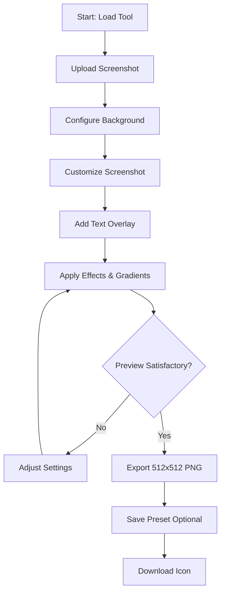
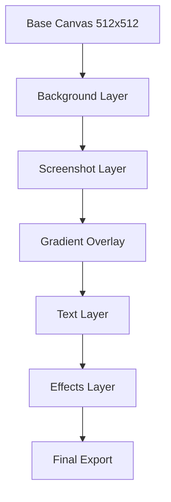
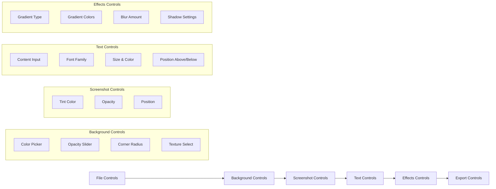
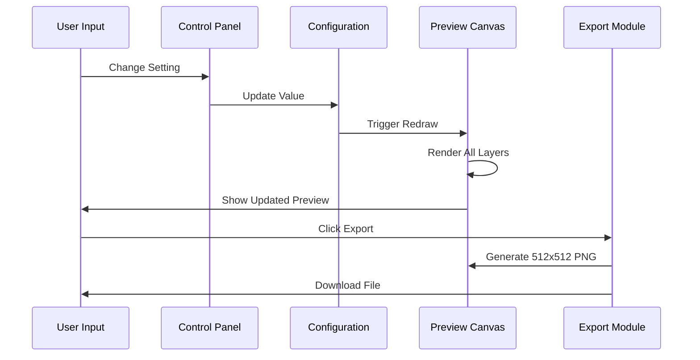

# Icon Creation Workflow

## Process Flow

## Layer Stacking Order

## Control Groups Organization

## Real-time Preview System

## Key User Interactions

1. **File Upload**
   - Drag & drop or file selector
   - Validate image dimensions
   - Auto-fit to canvas

2. **Background Customization**
   - Color picker with opacity
   - Corner radius slider (0-50px)
   - Texture pattern selection

3. **Screenshot Processing**
   - Tint color application
   - Opacity adjustment
   - Centering and scaling

4. **Text Overlay**
   - Dynamic text input
   - Font selection from system fonts
   - Position toggle (above/below)
   - Shadow and background options

5. **Effects Application**
   - Gradient type selection
   - Color stops configuration
   - Blur and shadow controls

6. **Export Process**
   - Generate high-quality 512x512 PNG
   - File naming convention
   - Preset saving/loading